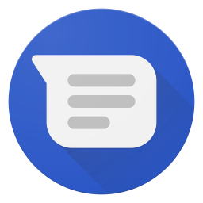

<p align="center">
  
</p>

<h1 align="center">Android Messages for Desktop</h1>

<p align="center">
  A simple desktop client for <a href="https://messages.google.com/web">Google Messages</a>, on macOS &amp; Windows.
</p>

<p align="center">
  <a href="LICENSE"></a>
  <a href="https://github.com/antoineguilbert/android-messages-for-desktop/releases/latest"></a>
  <a href="https://github.com/antoineguilbert/android-messages-for-desktop/releases"></a>
  <a href="https://github.com/antoineguilbert/android-messages-for-desktop/stargazers"></a>
</p>

---


## Features

- Standalone desktop app for Google Messages
- Native unread badge on macOS dock
- Built-in auto-updater
- Multilingual UI (English, French, German)
- Universal macOS build (Intel + Apple Silicon)

## Download

Grab the latest installer from the [Releases page](https://github.com/antoineguilbert/android-messages-for-desktop/releases/latest):

- **macOS** — `.dmg` (universal)
- **Windows** — `.exe` installer

## Development

Requires Node.js 22+.

```bash
git clone https://github.com/antoineguilbert/android-messages-for-desktop.git
cd android-messages-for-desktop
npm install
npm start          # run the app in dev
npm run pack       # build unpacked (no installer)
npm run build      # full installer for the current OS
```

## Translations

Translation files live in [translations/](translations/) as plain JSON. To add a language, copy `en.json`, translate the values, and open a PR.

## Support

If you enjoy the app, you can support development on Ko-fi:

<a href="https://ko-fi.com/antoineguilbert" target="_blank"></a>

## Author

**Antoine Guilbert** — [antoineguilbert.fr](https://www.antoineguilbert.fr)

## Disclaimer

This is not an official Google app and is not affiliated with Google. "Google Messages" is a trademark of Google LLC.

## License

[MIT](LICENSE) © Antoine Guilbert
